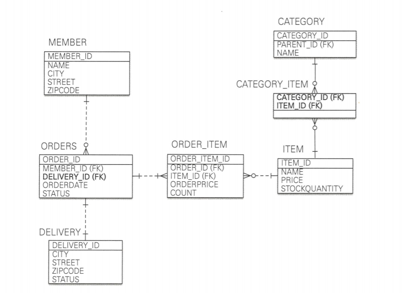

# \#06 실습

## 길잡이 

### ERD와 상세엔티티 




### 아래 참고하여 작성

```java
1. Member
private Long id; 
private String name;
private String city;
private String street;
private String zipcode;
private List<Order> orders;

조건들
id -> MEMBER_ID에 매핑

2. Order
private Long id;
private Member member;
private List<OrderItem> orderItems;
private Delivery delivery;
private Date orderDate;
private OrderStatus status;

3. OrderStatus  
CANCEL, ORDER

4. Delivery
private Long Id;
private Order Order;
private String city;
private String street;
private String zipcode;
private DeliveryStatus status;

5 DeliveryStatus
READY, COMPLETE //준비, 배송완료

6 OrderItem
private Long id;
private Item item;
private Order order;
private int orderPrice;
private int count;

7 Item
private Long id;
private String name;
private int price;
private int stockQuantity;
private List<Category> categories;

8 Category
private Long id;
private String name;
private List<item> items;
private Category parent;
private List<> child;
```


## 전체 코드

### \# Main.java 

```java
package jpabook.model;

import javax.persistence.EntityManager;
import javax.persistence.EntityManagerFactory;
import javax.persistence.EntityTransaction;
import javax.persistence.Persistence;

public class Main {

    public static void main(String[] args) {

        EntityManagerFactory emf = Persistence.createEntityManagerFactory("jpabook");
        EntityManager em = emf.createEntityManager(); 
        EntityTransaction tx = em.getTransaction(); //트랜잭션 기능 획득

        try {

            tx.begin(); 
            //TODO 비즈니스 로직
            tx.commit();

        } catch (Exception e) {
            e.printStackTrace();
            tx.rollback();
        } finally {
            em.close();
        }

        emf.close(); 
    }

}

```

### \# 1 Member

```java
import javax.persistence.*;
import java.util.ArrayList;
import java.util.List;


@Entity
public class Member {

    @Id @GeneratedValue
    @Column(name = "MEMBER_ID")
    private Long id;

    private String name;

    private String city;
    private String street;
    private String zipcode;

    @OneToMany(mappedBy = "member")
    private List<Order> orders = new ArrayList<Order>();

    public Long getId() {
        return id;
    }

    public void setId(Long id) {
        this.id = id;
    }

    public String getName() {
        return name;
    }

    public void setName(String name) {
        this.name = name;
    }

    public String getCity() {
        return city;
    }

    public void setCity(String city) {
        this.city = city;
    }

    public String getStreet() {
        return street;
    }

    public void setStreet(String street) {
        this.street = street;
    }

    public String getZipcode() {
        return zipcode;
    }

    public void setZipcode(String zipcode) {
        this.zipcode = zipcode;
    }

    public List<Order> getOrders() {
        return orders;
    }

    public void setOrders(List<Order> orders) {
        this.orders = orders;
    }
}
```

### \# 2 Order

```java
import javax.persistence.*;
import java.util.ArrayList;
import java.util.Date;
import java.util.List;

@Entity
@Table(name = "ORDERS")
public class Order {

    @Id @GeneratedValue
    @Column(name = "ORDER_ID")
    private Long id;

    @ManyToOne
    @JoinColumn(name = "MEMBER_ID")
    private Member member;      //주문 회원

    @OneToMany(mappedBy = "order")
    private List<OrderItem> orderItems = new ArrayList<OrderItem>();

    @OneToOne
    @JoinColumn(name = "DELIVERY_ID")
    private Delivery delivery;  //배송정보

    private Date orderDate;     //주문시간

    @Enumerated(EnumType.STRING)
    private OrderStatus status;//주문상태


    //==연관관계 편의 메서드==//
    public void setMember(Member member) {
        //기존 관계 제거
        if (this.member != null) {
            this.member.getOrders().remove(this);
        }
        this.member = member;
        member.getOrders().add(this);
    }

    public void addOrderItem(OrderItem orderItem) {
        orderItems.add(orderItem);
        orderItem.setOrder(this);
    }

    public void setDelivery(Delivery delivery) {
        this.delivery = delivery;
        delivery.setOrder(this);
    }

    //Getter, Setter
    public Long getId() {
        return id;
    }

    public void setId(Long id) {
        this.id = id;
    }

    public Member getMember() {
        return member;
    }

    public List<OrderItem> getOrderItems() {
        return orderItems;
    }

    public void setOrderItems(List<OrderItem> orderItems) {
        this.orderItems = orderItems;
    }

    public Delivery getDelivery() {
        return delivery;
    }

    public Date getOrderDate() {
        return orderDate;
    }

    public void setOrderDate(Date orderDate) {
        this.orderDate = orderDate;
    }

    public OrderStatus getStatus() {
        return status;
    }

    public void setStatus(OrderStatus status) {
        this.status = status;
    }

    @Override
    public String toString() {
        return "Order{" +
                "id=" + id +
                ", orderDate=" + orderDate +
                ", status=" + status +
                '}';
    }
}
```

### \# 3 OrderStatus

```java
 public enum OrderStatus {
    ORDER, CANCEL
}
```

### \# 4 Delivery

```java
import javax.persistence.*;

@Entity
public class Delivery {

    @Id @GeneratedValue
    @Column(name = "DELIVERY_ID")
    private Long id;

    @OneToOne(mappedBy = "delivery")
    private Order order;

    private String city;
    private String street;
    private String zipcode;

    @Enumerated(EnumType.STRING)
    private DeliveryStatus status; //ENUM [READY(준비), COMPLETE(배송)]

    //Getter, Setter
    public Long getId() {
        return id;
    }

    public void setId(Long id) {
        this.id = id;
    }

    public Order getOrder() {
        return order;
    }

    public void setOrder(Order order) {
        this.order = order;
    }

    public String getCity() {
        return city;
    }

    public void setCity(String city) {
        this.city = city;
    }

    public String getStreet() {
        return street;
    }

    public void setStreet(String street) {
        this.street = street;
    }

    public String getZipcode() {
        return zipcode;
    }

    public void setZipcode(String zipcode) {
        this.zipcode = zipcode;
    }

    public DeliveryStatus getStatus() {
        return status;
    }

    public void setStatus(DeliveryStatus status) {
        this.status = status;
    }
}
```

### \# 5 DeliveryStatus

```java
public enum DeliveryStatus {
    READY, //준비
    COMPLETE //배송완
}
```

### \# 6 OrderItem

```java
 import javax.persistence.*;


@Entity
@Table(name = "ORDER_ITEM")
public class OrderItem {

    @Id @GeneratedValue
    @Column(name = "ORDER_ITEM_ID")
    private Long id;

    @ManyToOne
    @JoinColumn(name = "ITEM_ID")
    private Item item;      //주문 상품

    @ManyToOne
    @JoinColumn(name = "ORDER_ID")
    private Order order;    //주문

    private int orderPrice; //주문 가격
    private int count;      //주문 수량

    //Getter, Setter
    public Long getId() {
        return id;
    }

    public void setId(Long id) {
        this.id = id;
    }

    public Item getItem() {
        return item;
    }

    public void setItem(Item item) {
        this.item = item;
    }

    public Order getOrder() {
        return order;
    }

    public void setOrder(Order order) {
        this.order = order;
    }

    public int getOrderPrice() {
        return orderPrice;
    }

    public void setOrderPrice(int buyPrice) {
        this.orderPrice = buyPrice;
    }

    public int getCount() {
        return count;
    }

    public void setCount(int count) {
        this.count = count;
    }

    @Override
    public String toString() {
        return "OrderItem{" +
                "id=" + id +
                ", buyPrice=" + orderPrice +
                ", count=" + count +
                '}';
    }
}
```

### \# 7 Item

```java
 import javax.persistence.*;
import java.util.ArrayList;
import java.util.List;

@Entity
public class Item {

    @Id
    @GeneratedValue
    @Column(name = "ITEM_ID")
    private Long id;

    private String name;        //이름
    private int price;          //가격
    private int stockQuantity;  //재고수량

    @ManyToMany(mappedBy = "items")                         
    private List<Category> categories = new ArrayList<Category>(); 

    //Getter, Setter
    public Long getId() {
        return id;
    }

    public void setId(Long id) {
        this.id = id;
    }

    public String getName() {
        return name;
    }

    public void setName(String name) {
        this.name = name;
    }

    public int getPrice() {
        return price;
    }

    public void setPrice(int price) {
        this.price = price;
    }

    public int getStockQuantity() {
        return stockQuantity;
    }

    public void setStockQuantity(int stockQuantity) {
        this.stockQuantity = stockQuantity;
    }

    public List<Category> getCategories() {
        return categories;
    }

    public void setCategories(List<Category> categories) {
        this.categories = categories;
    }

    @Override
    public String toString() {
        return "Item{" +
                "id=" + id +
                ", name='" + name + '\'' +
                ", price=" + price +
                '}';
    }
}
```

### \# 8 Category 

```java
import javax.persistence.*;
import java.util.ArrayList;
import java.util.List;

@Entity
public class Category {

    @Id @GeneratedValue
    @Column(name = "CATEGORY_ID")
    private Long id;

    private String name;

    @ManyToMany
    @JoinTable(name = "CATEGORY_ITEM",
            joinColumns = @JoinColumn(name = "CATEGORY_ID"),
            inverseJoinColumns = @JoinColumn(name = "ITEM_ID"))
    private List<Item> items = new ArrayList<Item>();

    @ManyToOne
    @JoinColumn(name = "PARENT_ID")
    private Category parent;

    @OneToMany(mappedBy = "parent")
    private List<Category> child = new ArrayList<Category>();

    //==연관관계 메서드==//
    public void addChildCategory(Category child) {
        this.child.add(child);
        child.setParent(this);
    }

    public void addItem(Item item) {
        items.add(item);
    }


    //Getter, Setter
    public Long getId() {
        return id;
    }

    public void setId(Long id) {
        this.id = id;
    }

    public String getName() {
        return name;
    }

    public void setName(String name) {
        this.name = name;
    }

    public List<Item> getItems() {
        return items;
    }

    public void setItems(List<Item> items) {
        this.items = items;
    }

    public Category getParent() {
        return parent;
    }

    public void setParent(Category parent) {
        this.parent = parent;
    }

    public List<Category> getChild() {
        return child;
    }

    public void setChild(List<Category> child) {
        this.child = child;
    }

    @Override
    public String toString() {
        return "Category{" +
                "id=" + id +
                ", name='" + name + '\'' +
                '}';
    }
}
```

## 코드 분석 

* 양방향인데 편의 메서드가 없는경우 서로 객체 그래프 탐색 기능이 필요하지 않다고 판단
* 조인테이블 
  * 카테고리와 아이템을 연결하기 위해 사용.

```java
1. 아이템
@ManyToMany(mappedBy = "items")                        
private List<Category> categories = new ArrayList<Category>();

2. 카테고리
@ManyToMany
@JoinTable(name = "CATEGORY_ITEM",
           joinColumns = @JoinColumn(name = "CATEGORY_ID"),
           inverseJoinColumns = @JoinColumn(name = "ITEM_ID"))
private List<Item> items = new ArrayList<Item>();

@ManyToOne
@JoinColumn(name = "PARENT_ID")
private Category parent;

@OneToMany(mappedBy = "parent")
private List<Category> child = new ArrayList<Category>();
```

## 요약 


